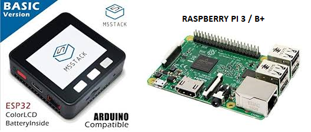

# IoT Panic Button
This is a project base for an IoT button/trigger. The goal is to raise an *alert/notification* from a small IoT device to the cloud

I've used M5Stack &amp; Raspberry: M5Stack makes HTTP requests to a nodejs microservice deployed on Raspberry to trigger some action. But you could replace the Raspberry with any other device or cloud service (any place where you would be able to deploy a nodejs service).

**M5Stack** is an Arduino development stack (more info here: https://github.com/m5stack) and could be replaced with ESP32+button or Arduino+Button+WiFi module (and you will need to replace M5Stack library references in the *ino* script with custom code, that's why M5Stack is very agile tool for arduino/esp32 development and tests).

**Raspberry** is mini-pc board (https://www.raspberrypi.org/)

## **Requeriments:** 
- Some basic experience with Arduino/esp32/M5Stack (setup Arduino IDE, compile/upload scripts)
- Raspberry with Raspbian or any linux distribution, nodejs/npm installed, and basic Rasbian/linux knowledge
- Local WiFi, you will need to know Raspberry IP (maybe you'll want to set it a static IP)

## Install:
**Install - M5Stack script:** 
- Clone/download project
- Open Arduino IDE
- Set it up: BOARD: M5Stack-Core-ESP32, download/update ESP32 and M5Stack libraries and boards
- Plug M5Stack with USB, open M5Stack_script\M5Stack_script.ino and upload script

**Install - Raspberry nodejs microservice:** 
- Open a shell
- Clone/download project in a Raspberry user folder
- Get into "nodejs_script" folder
- Run: "npm install" to install the project dependencies
- Run: "npm start" to start the service

## Applications: 
This is a base project for multiple applications. I've used it to generate notifications in my Android device from IoT events. I have extended the raspberry nodejs microserver script to store requests in a cloud database and I've made an Android app with a service listener for these alerts creation in database (I've used Firebase as Cloud backend for the database, https://firebase.google.com/). You can extend the nodejs microservice for Raspberry to store or trigger whatever you want. And also you can extend the M5Stack script to raise the alert by any other event instead of button click, plugin new sensors or devices ... enjoy yourself. Happy hacking!
